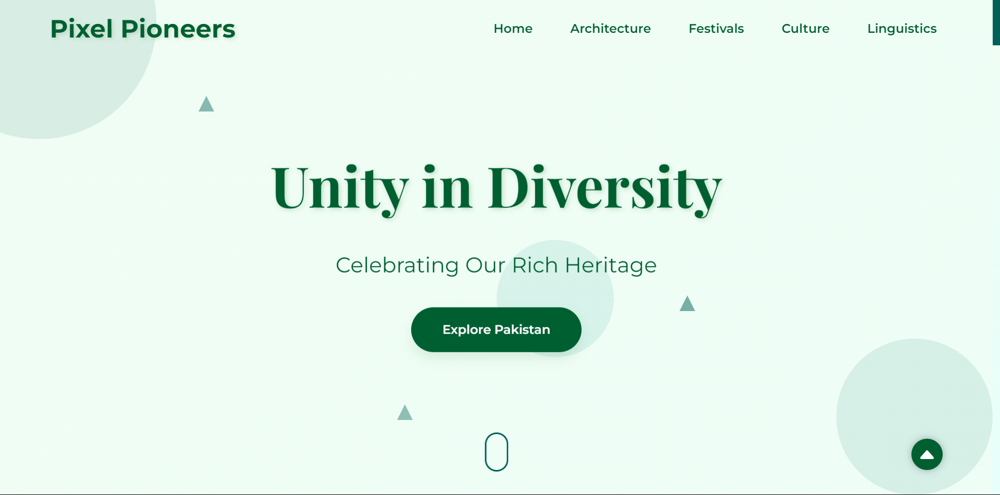
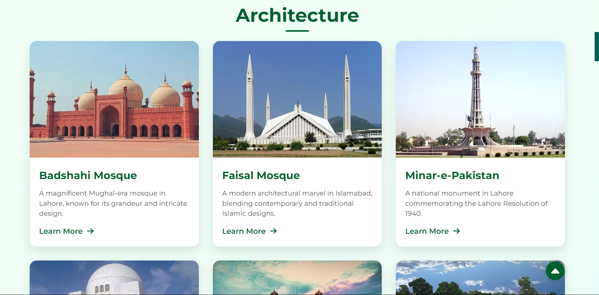
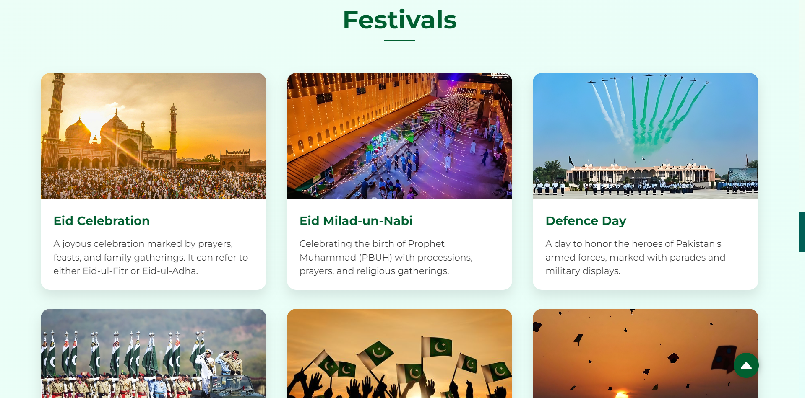
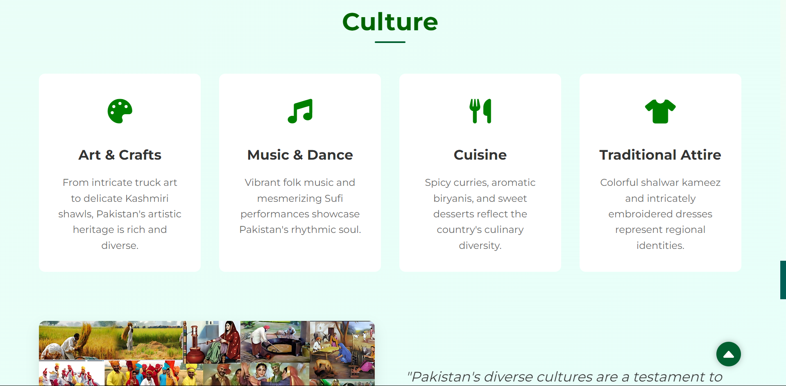

# Unity in Diversity - Pakistan Independence Day Landing Page



**A stunning, responsive landing page celebrating the theme of Unity in Diversity for Pakistan’s Independence Day.**

## Overview

This landing page is a competition entry for the Pakistan Pride Landing Page Competition, celebrating the Independence Day of Pakistan. The theme, "Unity in Diversity," is presented through a visually appealing design that highlights the diverse cultures, traditions, and national pride of Pakistan. The landing page is fully responsive, ensuring a seamless experience across all devices.

## Features

- **Hero Section:** A full-screen, animated hero section with a captivating visual display of Pakistan's diverse culture.
- **Festivals Section:** Showcasing major festivals like Eid-ul-Fitr, Basant, and Independence Day with smooth animations and transitions.
- **Architecture Section:** A beautifully designed timeline that highlights iconic Pakistani architecture, such as the Badshahi Mosque and Minar-e-Pakistan.
- **Culture Section:** A beautifully designed section highlighting the rich culture of all the provinces and what makes this country unique.
- **Responsive Design:** Ensures optimal viewing on all devices, from mobile phones to desktops.
- **Smooth Animations:** Implemented using AOS (Animate On Scroll) library for a dynamic user experience.
- **SEO Optimized:** Proper meta tags and content structure to improve search engine rankings.

## Installation

To run this project locally, follow these steps:

1. Clone the repository:

   ```bash
   git clone https://github.com/WebDev-Haseeb/landing-page-design
   ```

2. Navigate to the project directory:

   ```bash
   cd landing-page-design
   ```

3. Open the `index.html` file in your preferred browser to view the landing page.

## Usage

The landing page can be used as a template for any cultural or national celebration. It is designed to be easily customizable, allowing you to modify the content and images to fit different themes or events.

## Screenshots

### Architecture Section


### Festivals Section


### Culture Section


## Contributing

If you'd like to contribute to this project, feel free to fork the repository and submit a pull request. Contributions are welcome!